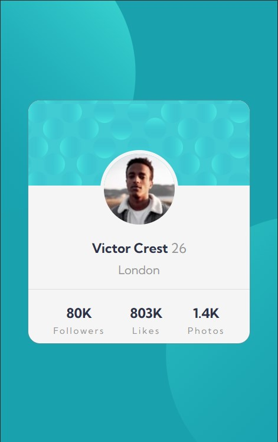

# Frontend Mentor - Profile card component solution

This is a solution to the [Profile card component challenge on Frontend Mentor](https://www.frontendmentor.io/challenges/profile-card-component-cfArpWshJ). Frontend Mentor challenges help you improve your coding skills by building realistic projects.

## Table of contents

- [Frontend Mentor - Profile card component solution](#frontend-mentor---profile-card-component-solution)
  - [Table of contents](#table-of-contents)
  - [Overview](#overview)
    - [The challenge](#the-challenge)
    - [Screenshot](#screenshot)
    - [Links](#links)
  - [My process](#my-process)
    - [Built with](#built-with)
    - [What I learned](#what-i-learned)
    - [Useful resources](#useful-resources)
  - [Author](#author)

## Overview

### The challenge

- The Challenge was to build out the project to the designs provided

### Screenshot

- Here are screenshots of my finished work




### Links

- Solution URL: [Github Repo](https://github.com/NwanXche20/Frontendmentor-Challenge-profile-card-component)
- Live Site URL: [Live site from Github pages](https://nwanxche20.github.io/Frontendmentor-Challenge-profile-card-component)

## My process

### Built with

- Semantic HTML5 markup
- Plain CSS including the var() function
- Flexbox
- Mobile-first workflow

### What I learned

Working on this project, I learned it is possible to add more than one background image on an element as well as positioning it to fit your design. I didn't know this prior.

Something like this:

```css
main {
  background-image: url(./images/bg-pattern-top.svg),
    url(./images/bg-pattern-bottom.svg);
  background-position: -12em -40%, 14em 130%;
}
```

### Useful resources

- [Multiple background images and positioning resource ](https://www.geeksforgeeks.org/css-background-position-property/) - This helped me for positioning the background images.

## Author

- Website - [Uchechukwu Chigozie Nwaneri](https://uchechukwu.vercel.app)
- Frontend Mentor - [@NwanXche20](https://www.frontendmentor.io/profile/@NwanXche20)
